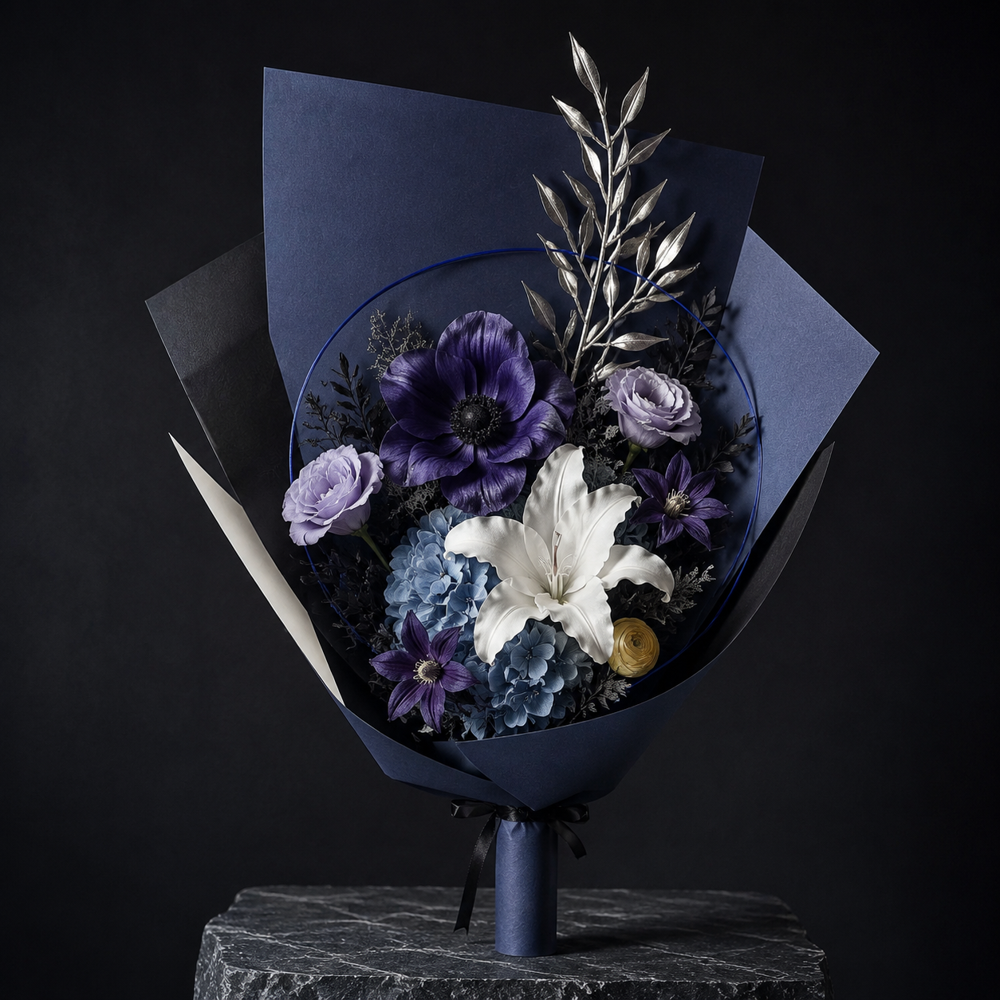
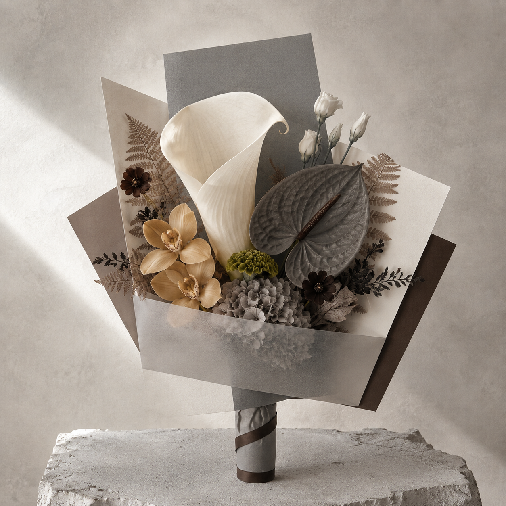
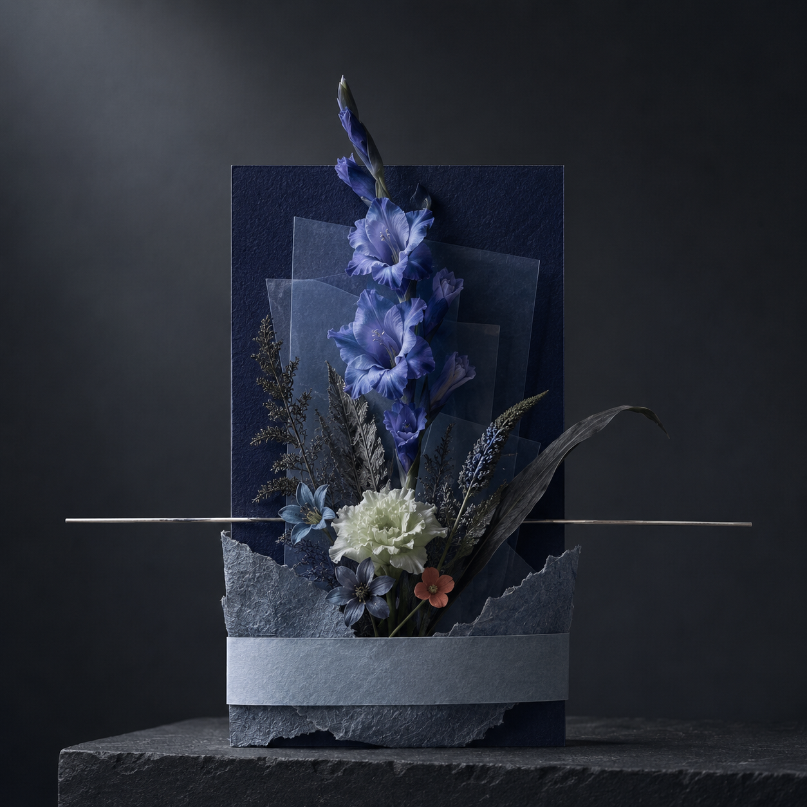
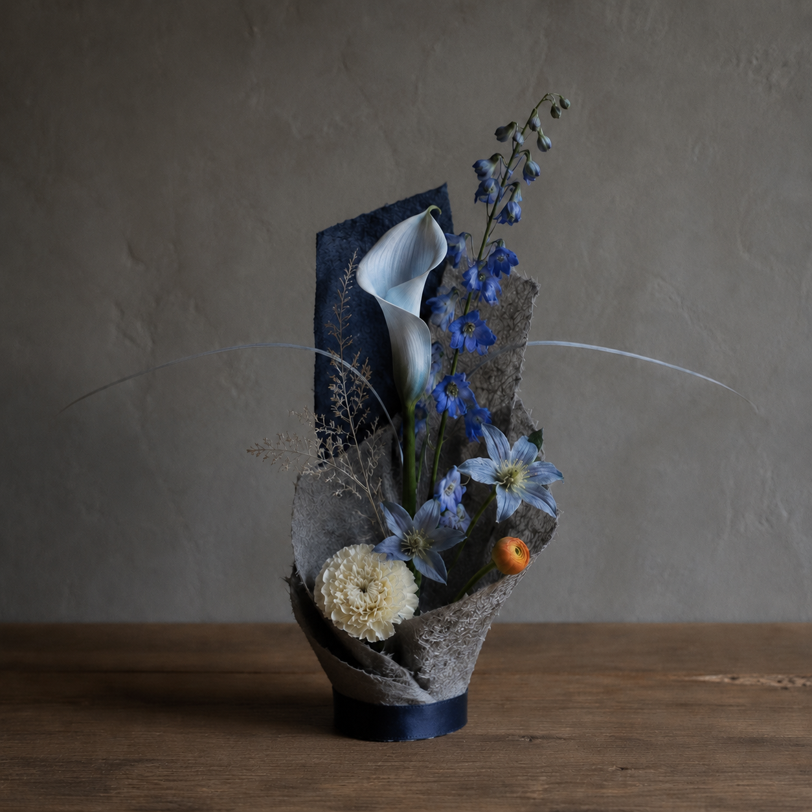
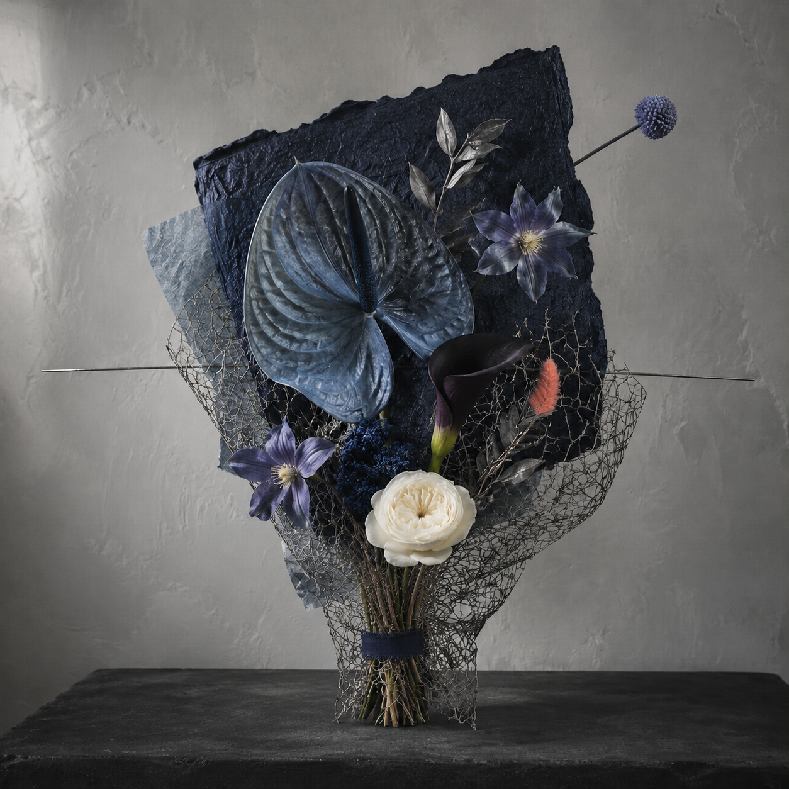

# Album to Bouquet

A Codex skill that turns one album-cover image into a photorealistic album-derived floral art object.

**Current public release: V8.0 — Bouquet First**



Independent restrained-palette test:



V4 controlled-randomness test from one cover:

| Architectural Object | Living Sculpture | Raw Couture |
| --- | --- | --- |
|  |  |  |

V4 does more than sample colours. The skill translates palette, value structure, geometry, rhythm and visual mood into an Object Prescription, then generates a complete floral object under a strict quality gate. Automated palette evidence is followed by semantic-accent review so a small but memorable colour is not lost.

V5 adds two finishing systems learned from real output tests: adaptive borderless cover integration and a fully resolved paper-wrapped gift handle. The exact source cover is never redrawn or recoloured. Its size and corner adapt to the final orientation, while the surrounding scene—not a decorative frame—creates visual continuity. Gift bouquets no longer end in a long exposed fan of stems unless raw stems are explicitly requested.

V6 corrects composition drift discovered during paired-output testing. Both outputs now default to vertical portraits with the bouquet or vessel on the optical centre line. Home Living Art uses a centred floral-tree structure—grounded vessel, central rise and controlled crown—while the comparison cover adapts to a quiet corner instead of forcing the floral object toward the edge.

V7 strengthens the album's presence without weakening the centred composition. Portrait covers now default to roughly 24% of frame width with a deeper edge inset, automatic placement chooses the quieter upper quadrant, and every scene establishes a restrained visual bridge through shared field colour, a major material echo and one semantic signal. The cover remains borderless, but no longer reads as a tiny detached UI thumbnail.

V7.1 closes a final paired-output regression discovered in a three-cover blind test. Tall line flowers may still form a grove-like Gift Bouquet, but the stems must converge into a real hand-tied binding and tapered paper grip. A hatbox, pedestal or rigid cylindrical flower container is not a bouquet handle; vessel-supported structures belong in Home Living Art.

V7.2 tested light and petal realism across three previously generated results. It established that “premium” must not collapse into underexposure: album-dependent low-key light remains available, but darkness belongs mainly in the background, wrapping, foliage and cast shadows. Hero and support flowers must retain readable midtones, species-specific softness, petal thickness, folds and restrained edge translucency without plastic gloss, airbrushing, sharpening halos or HDR-like texture.

V8 makes the user's preferred result the product default: one vertical, physically sendable `Gift Bouquet` with the exact source cover integrated into the same photographic field. `Home Living Art` remains available only when explicitly requested. Controlled randomness now means two or three independent bouquet candidates, each scored on its own—not a mandatory pair for every prescription.

## What it produces

- one vertical sendable `Gift Bouquet` by default;
- the exact original cover, borderlessly composited into the final photograph and large enough to compare;
- an optional vessel-supported `Home Living Art` image only when explicitly requested;
- a concise Object Prescription when useful;
- one controlled revision if an image fails the quality gate;
- two or three controlled-random variants when exploration is requested.

The V4 `Album Object` system supports three structural modes—Architectural Object, Raw Couture and Living Sculpture—and three size tiers. Wrapping is constructed as a graphic backboard, tactile cradle and restrained binding. Randomness may vary structure and materials, but never the album identity or quality gate. A conventional `Living Bouquet` remains available only when explicitly requested.

The V5 finishing gate requires unmarked negative space for the comparison cover, rejects generated placeholder frames, adapts cover size to portrait/square/landscape output, and completes the gift handle with an album-derived paper sheath.

The V6 balance gate rejects large one-sided voids and side-loaded objects. The cover card is secondary: if necessary it becomes slightly smaller or changes corner; the floral composition remains centred.

The V7 connection gate rejects covers that are too small, pinned to the extreme corner or visibly unrelated to the floral world. The card stays subordinate to the flowers but must be readable and visually consequential.

The V8 realism gate chooses `soft high-key`, `balanced editorial` or `low-key dramatic` light from the album. Even dark albums must preserve readable flower midtones and species-specific petal texture. The bouquet remains the default deliverable; home living art is an opt-in extension.

## Install

Copy the `album-to-bouquet` folder into your user-level Codex skills directory:

```bash
mkdir -p "$HOME/.agents/skills"
cp -R album-to-bouquet "$HOME/.agents/skills/"
```

For repository-only use, place it at `.agents/skills/album-to-bouquet` inside that repository instead. Codex normally detects changes automatically; restart it if the skill does not appear.

The skill itself needs no API key or `.env` file. Image creation requires a Codex environment with an image-generation tool. The optional local analysis and compositing scripts require Python 3 and Pillow:

```bash
python3 -m pip install -r requirements.txt
```

## Use

Attach one album-cover image and say:

```text
Use $album-to-bouquet to turn this album cover into one vertical Gift Bouquet with the exact original cover integrated into the final photograph.
```

For controlled exploration:

```text
Use $album-to-bouquet to create three random but coherent Gift Bouquet variants from this cover. Keep the album identity fixed and score each image independently.
```

Album title, artist, recipient and a note are optional. The skill should work from the cover image alone.

For a release smoke test, attach a cover that has not appeared in the examples and use:

```text
Use $album-to-bouquet for an independent blind test of this album cover.
Return one vertical Gift Bouquet with a finished paper-wrapped handle.
Composite the exact source cover into the result, score it against the quality
gate, and allow at most one targeted revision.
```

A passing result should preserve natural flower morphology, plausible scale and species-specific petal texture; keep the bouquet centred; show a readable borderless source cover; and make the album relationship visible without relying on written explanation.

To composite an exact source cover into a finished floral scene:

```bash
python3 scripts/compose_album_card.py scene.png cover.jpg final.png
```

The default is adaptive and borderless. Optional controls include `--width-ratio`, `--position`, and `--integration ambient|shadow|none`.

## Optional palette test

The included script extracts objective colour and tonal evidence locally:

```bash
python3 scripts/analyze_album.py path/to/cover.jpg
```

It requires Python 3 and Pillow:

```bash
python3 -m pip install Pillow
```

The script does not upload the album cover. Mood interpretation and image generation are handled by Codex with an available image-generation tool.

## Design boundaries

- no literal copying of people, text, logos or artwork from the cover;
- no PNG flower cutout collage;
- no dense round wedding bouquet;
- no random giant-envelope packaging, bow, text block or watermark;
- no generated frame or placeholder box around the later exact-cover position;
- no decorative border around the source cover by default;
- no long exposed bundle of stems below a finished Gift Bouquet;
- no hatbox, pedestal, rigid flower box or vessel-like cylindrical base disguised as the handle of a tall Gift Bouquet;
- no side-loaded bouquet or vessel created merely to reserve album-cover space;
- portrait orientation and an optically centred main mass by default;
- no tiny extreme-corner album thumbnail; use a readable inset cover with a visible colour/material connection;
- no uniformly dark house look; derive exposure from the album and preserve readable floral midtones;
- no featureless airbrushed petals, uniform waxy shine, sharpening halos, HDR-like edges or artificial wet gloss;
- only one controlled non-natural material effect per object;
- no literal cover art, faces, title, logo, lyric or illustration;
- album colours must structure flowers, wrapping and material—not recolour everything identically.

## Repository structure

```text
album-to-bouquet/
├── SKILL.md
├── agents/openai.yaml
├── references/album-object-grammar.md
├── references/botanical-integrity-and-output-modes.md
├── references/cover-integration-and-gift-finishing.md
├── references/controlled-randomness.md
├── references/floral-grammar.md
├── scripts/analyze_album.py
├── scripts/compose_album_card.py
├── scripts/randomize_prescription.py
├── requirements.txt
├── examples/
├── PROJECT_JOURNEY.md
└── LICENSE
```

## License

MIT © 2026 Mirabelle Hu

The MIT license covers this skill's code and documentation. Album artwork remains the property of its respective rights holder. Use covers you own or are permitted to process, and do not commit third-party source covers or final composites to a public repository without the necessary rights.

The design and product evolution is documented in [PROJECT_JOURNEY.md](PROJECT_JOURNEY.md).
